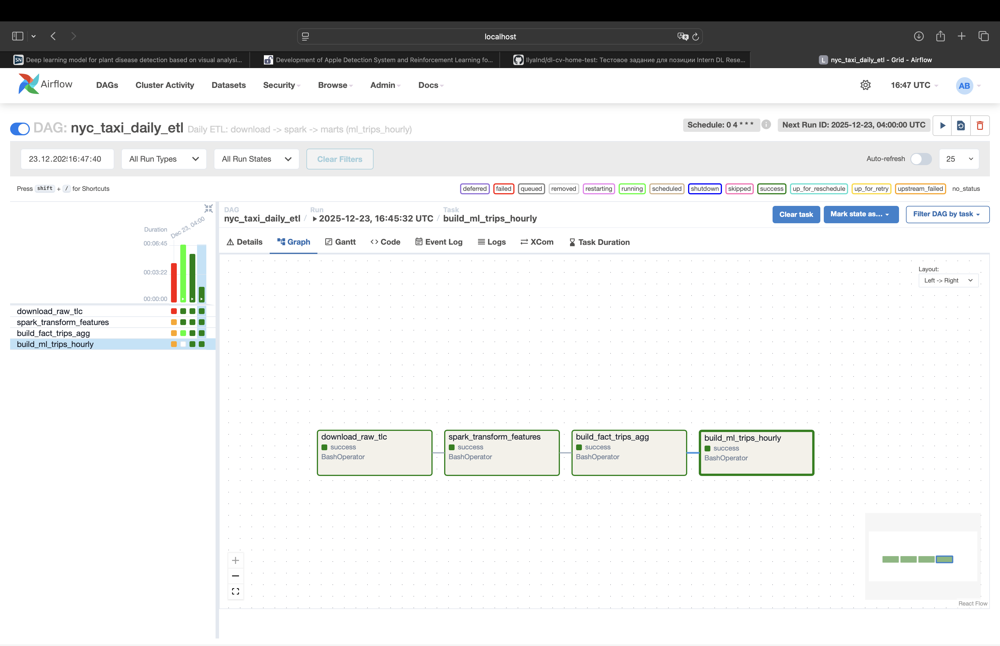
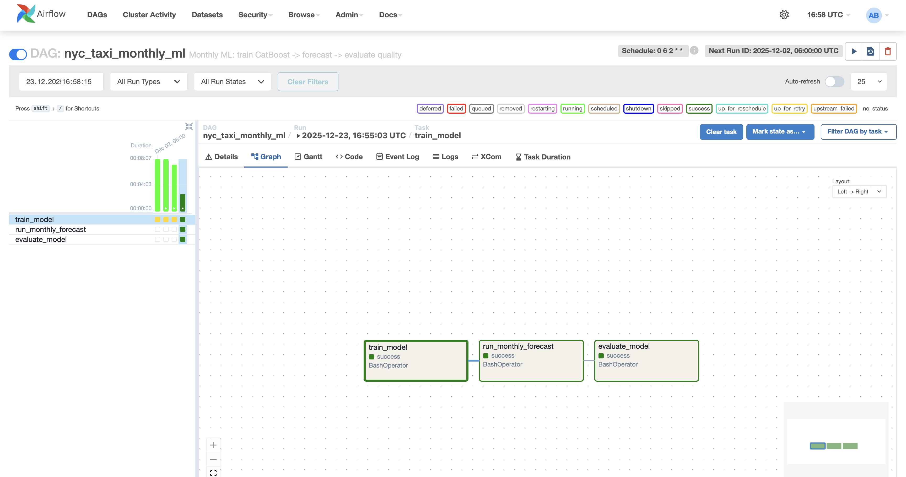
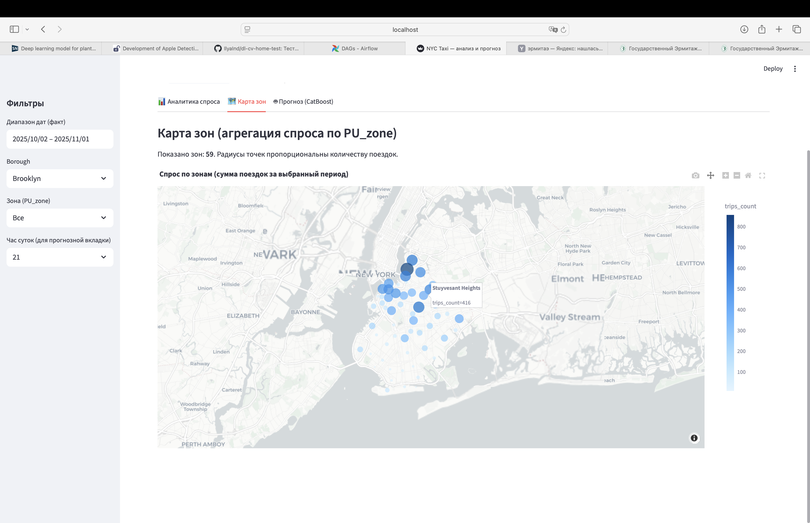
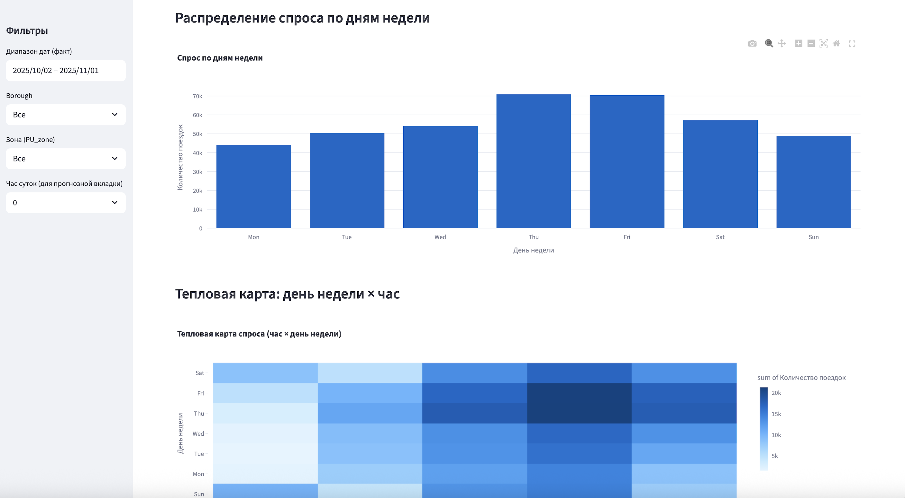
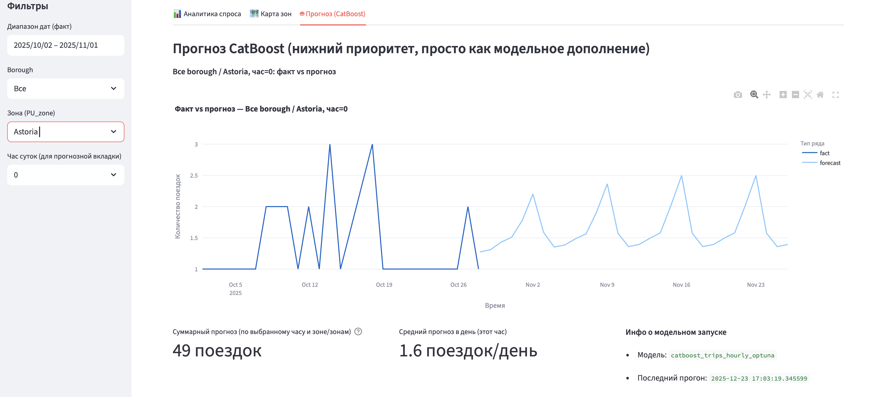
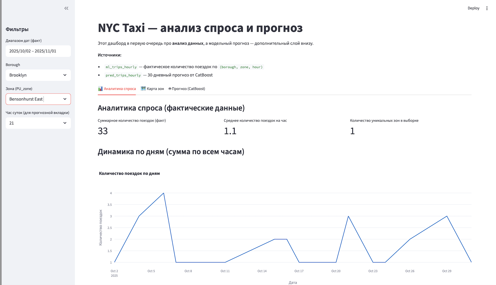

# NYC Taxi Demand Forecasting (bigdata_project)

Полный цикл: скачивание TLC yellow, спарк-препроцессинг, загрузка агрегатов в PostgreSQL, сбор ML-витрины, обучение CatBoost, прогнозы и дашборды Streamlit. Airflow используется как оркестратор, но пайплайн можно запускать и из командной строки.

## Структура репозитория
```
bigdata_project/
├─ config/
│  └─ pipeline_params.example.yaml   # шаблон параметров пайплайна
├─ data/                             # сырые/промежуточные данные (не в гите)
├─ spark_jobs/                       # Spark-преобразования и загрузка в PG
├─ src/                              # утилиты (скачивание TLC и т.п.)
├─ ml/                               # обучение/инференс CatBoost
├─ dashboards/                       # Streamlit-приложения
├─ scripts/                          # вспомогательные скрипты/оценки
├─ dags/                             # DAG-и Airflow
├─ models/, catboost_info/           # сохранённые модели и логи обучения
├─ docker-compose.yml, Dockerfile    # стек Postgres + Airflow + Streamlit
└─ requirements.txt                  # зависимости Python
```

## Предварительные требования
- Python 3.10+, виртуальное окружение.
- Java + Spark (для локального `spark-submit`).
- Docker (если поднимаешь Postgres/Airflow/Streamlit через `docker-compose`).
- Postgres: по умолчанию `localhost:5435` → контейнер `5432`, база `nyc_taxi`, user/pass `postgres/1234` (захардкожено в скриптах и docker-compose).

## Быстрый старт (CLI, без Airflow)
1. Склонировать и подготовить окружение:
   ```bash
   cp config/pipeline_params.example.yaml config/pipeline_params.yaml  # при необходимости поправь значения
   python -m venv venv
   source venv/bin/activate  # Windows: venv\Scripts\activate
   pip install -r requirements.txt
   ```
   (Опционально: `docker-compose up -d postgres` чтобы поднять локальный PG.)

2. Скачать данные TLC и справочники:
   ```bash
   python src/download_tlc_yellow_dynamic.py   # по умолчанию последние 6 месяцев, lookup в data/reference
   ```

3. Построить признаки и витрины (Spark):
   ```bash
   spark-submit spark_jobs/transform_features.py          # -> data/processed/nyc_taxi_features.parquet
   spark-submit spark_jobs/build_fact_trips_agg.py        # -> таблица fact_trips_agg в PG
   spark-submit spark_jobs/build_ml_dataset_trips_hourly.py  # -> таблица ml_trips_hourly в PG
   ```

4. Обучить модель и сохранить веса:
   ```bash
   python ml/train_trips_catboost_optuna.py    # Optuna + CatBoost -> models/catboost_trips_hourly_optuna.cbm
   # или прод-режим без тюнинга:
   python ml/train_trips_catboost_prod.py
   ```

5. Сделать прогноз на 30 дней вперёд и записать в PG:
   ```bash
   python ml/predict_next_month.py   # пишет в pred_trips_hourly
   ```

6. Проверить метрики:
   ```bash
   python scripts/evaluate_model_hourly.py
   ```

7. Дашборды (Streamlit):
   ```bash
   streamlit run dashboards/app_forecast_trips.py --server.address 0.0.0.0 --server.port 8501
   # качество модели:
   streamlit run dashboards/app_model_quality.py
   ```
   > Примечание: локально Streamlit стартует из venv. В docker-сервисе `streamlit` при первой сборке возможны проблемы, если не скачался базовый образ/зависимости. Решение — `docker-compose build --no-cache streamlit` и убедиться, что внутри есть бинарь `streamlit` (см. логи).

## Airflow
- DAG `nyc_taxi_daily_etl` (dags/nyc_taxi_daily_etl.py) повторяет шаги: download → transform_features → build_fact_trips_agg → build_ml_trips_hourly.
- Запуск стека: `docker-compose up -d` (поднимет Postgres, Airflow webserver/scheduler, Streamlit).
- Airflow Web UI: http://localhost:8080 (логин/пароль admin/admin123).
 - Если поднимаешь локально без Docker: `export AIRFLOW_HOME=$PWD/.airflow_local && airflow db upgrade && airflow standalone` (или webserver+scheduler), `AIRFLOW__CORE__DAGS_FOLDER=$PWD/dags`.

## Конфигурация параметров
- Шаблон: `config/pipeline_params.example.yaml` (копируй в `config/pipeline_params.yaml`, добавь в `.gitignore`).
- Что там хранить: `months_back` для скачивания, sample_fraction, Spark master/память, креды PG, имена таблиц, пути к данным и моделям, порты дашборда.
- Скрипты сейчас используют дефолты, захардкоженные в коде; файл конфигурации — единый источник договорённостей. При необходимости прокидывай значения через переменные окружения/CLI и синхронизируй с этим файлом.

## Полезные заметки
- В `spark_jobs/transform_features.py` есть `sample(fraction=0.1)` для отладки; для полного прогона установи 1.0.
- Данные, модели, логи и локальные конфиги не должны попадать в репозиторий (см. `.gitignore`).
- Порты: Postgres 5435->5432 (docker), Airflow 8080, Streamlit 8501 — при конфликте переопредели в `docker-compose.yml`.

## Скриншоты
- Airflow DAG daily ETL  
  
- Airflow DAG monthly ML  
  
- Streamlit: прогноз по зонам  
  
- Streamlit: график прогноза  
  
- Streamlit: карточка предсказания  
  
- Streamlit: анализ ошибок модели  
  


